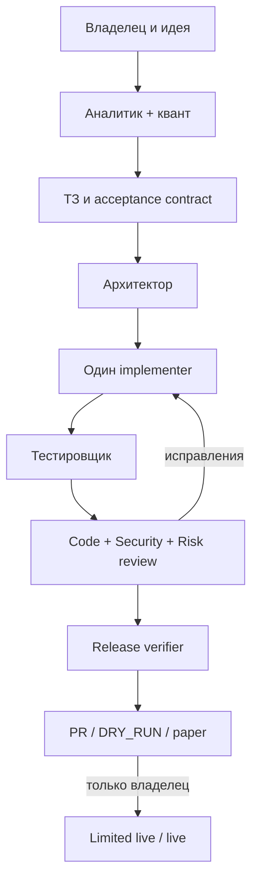

# Архитектура фабрики

Фабрика использует supervisor-подход: корневой агент владеет требованиями, итоговыми изменениями и порядком этапов, а специализированные агенты возвращают ограниченные handoff-результаты. Роли проверки независимы от роли реализации.

## Почему не свободный group chat

Свободная дискуссия ролей трудно воспроизводится: агенты могут согласиться друг с другом без доказательств, потерять ограничения или бесконечно передавать задачу. Здесь порядок детерминирован, каждый этап имеет вход, выход и gate, а глубина делегирования ограничена единицей.

## Разделение полномочий

- Read-only роли анализируют и проверяют.
- Writer только один: root при спецификации или implementer при коде.
- Risk и approval policy считаются owner-locked.
- Release verifier не исправляет код и поэтому не проверяет сам себя.
- Live boundary находится вне обычного цикла разработки.

## Два уровня самопроверки

1. Детерминированный: parser, schema/TOML validation, linters, tests, replay, secret scan, CI.
2. Семантический: независимые code/security/risk reviewers и release verifier.

Семантический reviewer не заменяет тест. Тест не заменяет финансовое утверждение владельца.

